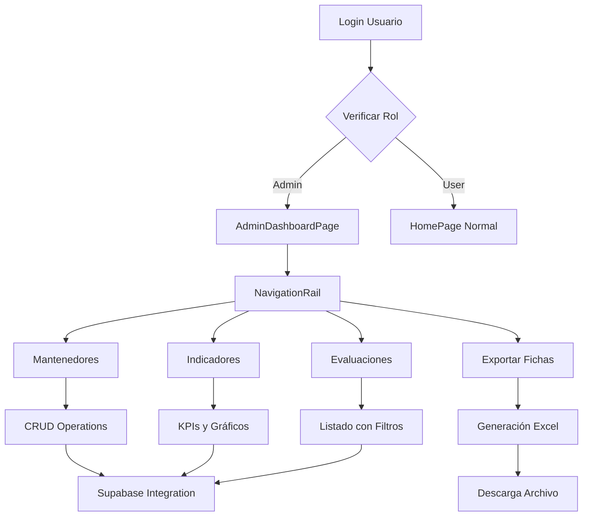

# Módulo de Administración - Vive Good App

## 1. Product Overview

Sistema de administración completo para la aplicación Vive Good que permite a los usuarios con rol "admin" gestionar usuarios, visualizar indicadores de salud, administrar evaluaciones y exportar reportes. El módulo sigue Clean Architecture y se integra con Supabase manteniendo la coherencia visual de la aplicación.

- **Propósito principal**: Proporcionar herramientas de administración y análisis para supervisar el uso de la aplicación y gestionar datos de usuarios de manera eficiente.
- **Usuarios objetivo**: Administradores del sistema con rol "admin" en la tabla user_roles.
- **Valor del producto**: Centralizar la gestión administrativa y proporcionar insights valiosos sobre el comportamiento y salud de los usuarios.

## 2. Core Features

### 2.1 User Roles

| Role | Registration Method | Core Permissions |
|------|---------------------|------------------|
| Admin | Asignación manual en base de datos | Acceso completo al módulo de administración, gestión de usuarios, visualización de indicadores, exportación de datos |
| User | Registro por email (rol por defecto) | Sin acceso al módulo de administración, redirigido a HomePage normal |

### 2.2 Feature Module

Nuestro módulo de administración consiste en las siguientes páginas principales:

1. **Panel de Administración**: dashboard principal con navegación lateral, verificación de roles, tarjetas de resumen.
2. **Mantenedores**: gestión CRUD de usuarios, roles, categorías, hábitos alimenticios y reglas médicas.
3. **Indicadores**: visualización de KPIs y gráficos de aceptación tecnológica, conocimiento de síntomas y hábitos de riesgo.
4. **Evaluaciones**: listado detallado de evaluaciones individuales con filtros y vista de detalles.
5. **Exportar Fichas**: generación y descarga de reportes en Excel con múltiples hojas de datos.

### 2.3 Page Details

| Page Name | Module Name | Feature description |
|-----------|-------------|---------------------|
| Panel de Administración | Dashboard Principal | Verificar rol de usuario, mostrar NavigationRail con secciones, tarjetas de resumen, botón de reporte general |
| Panel de Administración | Verificación de Roles | Validar user_roles.role == 'admin', redirigir a HomePage si no es admin |
| Panel de Administración | Navegación Lateral | NavigationRail con iconos Cupertino para Mantenedores, Indicadores, Evaluaciones, Exportar |
| Mantenedores | Gestión de Usuarios | Listar usuarios registrados, crear/editar/eliminar usuarios, modal de formulario |
| Mantenedores | Gestión de Roles | CRUD completo de roles del sistema con validaciones |
| Mantenedores | Gestión de Categorías | Administrar categorías de hábitos y síntomas |
| Mantenedores | Gestión de Hábitos | CRUD de hábitos alimenticios con categorización |
| Mantenedores | Gestión de Reglas | Administrar reglas médicas y recomendaciones |
| Indicadores | KPIs Principales | Mostrar tarjetas con promedio de aceptación tecnológica, conocimiento síntomas, hábitos de riesgo |
| Indicadores | Gráficos Estadísticos | Visualizar gráficos de barras/pastel con comparaciones y tendencias |
| Indicadores | Análisis de Datos | Procesar datos de tablas aceptacion_tecnologica, conocimiento_sintomas, habitos_alimenticios_riesgo |
| Evaluaciones | Listado de Evaluaciones | Mostrar tabla con evaluaciones por usuario, fecha, puntajes, acciones |
| Evaluaciones | Filtros de Búsqueda | Implementar filtros por fecha, nombre de usuario, tipo de evaluación |
| Evaluaciones | Vista de Detalles | Modal con información completa del registro seleccionado incluyendo JSON de hábitos |
| Exportar Fichas | Generación de Excel | Crear archivo .xlsx con 4 hojas: síntomas, aceptación, hábitos, consolidado |
| Exportar Fichas | Descarga de Archivos | Usar path_provider y open_filex para guardar y abrir archivos |
| Exportar Fichas | Notificaciones | Mostrar confirmación de exportación exitosa |

## 3. Core Process

### Flujo Principal del Administrador

1. **Autenticación y Verificación**: El usuario inicia sesión y el sistema verifica su rol en user_roles
2. **Acceso al Dashboard**: Si es admin, accede al Panel de Administración; si no, es redirigido al HomePage
3. **Navegación por Módulos**: Usa el NavigationRail para acceder a diferentes secciones
4. **Gestión de Datos**: Realiza operaciones CRUD en los mantenedores según necesidad
5. **Análisis de Información**: Consulta indicadores y evaluaciones para tomar decisiones
6. **Exportación de Reportes**: Genera y descarga fichas en Excel cuando sea necesario

### Flujo de Usuario Regular

1. **Intento de Acceso**: Usuario regular intenta acceder al módulo admin
2. **Verificación de Rol**: Sistema detecta que no tiene rol admin
3. **Redirección**: Automáticamente redirigido al HomePage normal

## 4. User Interface Design

### 4.1 Design Style

- **Colores primarios**: Azul #2196F3 (principal), Naranja #FF9800 (secundario)
- **Estilo de botones**: Bordes redondeados (borderRadius: 16), sombra sutil
- **Tipografía**: Fuente moderna consistente con el tema principal de la app
- **Estilo de layout**: Diseño de tarjetas con NavigationRail lateral, fondo blanco
- **Iconografía**: CupertinoIcons (graph_square_fill, doc_chart_fill, square_list_fill, etc.)

### 4.2 Page Design Overview

| Page Name | Module Name | UI Elements |
|-----------|-------------|-------------|
| Panel de Administración | Dashboard Principal | AppBar azul con título "Panel de Administración", NavigationRail lateral con iconos Cupertino, tarjetas KPI con colores azul claro, botón naranja "Reporte General" |
| Panel de Administración | NavigationRail | Fondo blanco, iconos azules, texto descriptivo, hover effects, indicador de sección activa |
| Mantenedores | Listados CRUD | DataTable con headers azules, botones de acción naranjas, modal dialogs con formularios, campos de texto con bordes redondeados |
| Mantenedores | Formularios Modal | Dialog con fondo blanco, campos de entrada con validación, botones Guardar/Cancelar, animaciones suaves |
| Indicadores | Tarjetas KPI | Cards con gradiente azul claro, iconos grandes, números destacados, colores diferenciados por métrica |
| Indicadores | Gráficos | Gráficos fl_chart con paleta azul/naranja, etiquetas legibles, leyendas claras, responsive design |
| Evaluaciones | Tabla de Datos | DataTable responsive, filtros superiores, botones "Ver Detalle" azules, paginación |
| Evaluaciones | Modal de Detalles | Dialog expandido con información completa, JSON formateado, botones de acción |
| Exportar Fichas | Interfaz de Exportación | Botón principal "Generar Fichas" naranja, indicadores de progreso, notificaciones de éxito verdes |

### 4.3 Responsiveness

El módulo está diseñado con enfoque desktop-first pero adaptable a tablets y móviles. En dispositivos pequeños, el NavigationRail se convierte en Drawer. Las tablas implementan scroll horizontal y los gráficos se ajustan automáticamente. Se considera optimización táctil para tablets.