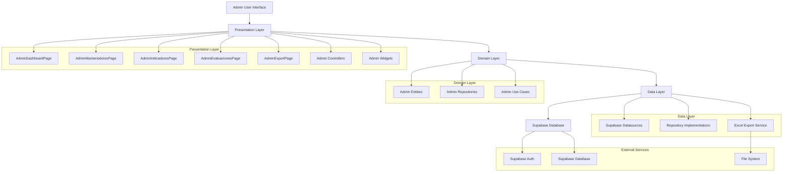
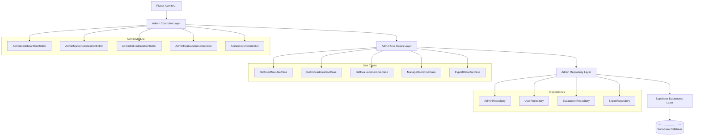
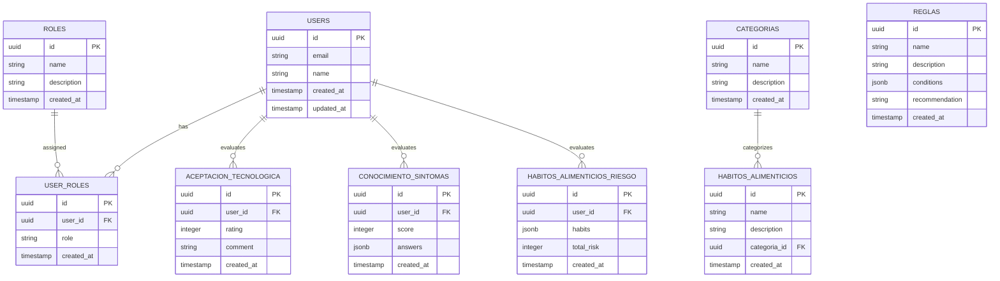

# Arquitectura Técnica - Módulo de Administración

## 1. Architecture design



## 2. Technology Description

- Frontend: Flutter@3.x + provider@6.x + fl_chart@0.68.x + excel@4.x
- Backend: Supabase (PostgreSQL + Auth + Storage)
- State Management: Provider/ChangeNotifier
- Charts: fl_chart para visualizaciones
- Excel Export: excel package para generación de archivos
- File Management: path_provider + open_filex

## 3. Route definitions

| Route | Purpose |
|-------|---------|
| /admin | Panel principal de administración, verificación de roles |
| /admin/dashboard | Dashboard con NavigationRail y resumen de KPIs |
| /admin/mantenedores | Gestión CRUD de usuarios, roles, categorías, hábitos, reglas |
| /admin/indicadores | Visualización de KPIs y gráficos estadísticos |
| /admin/evaluaciones | Listado de evaluaciones individuales con filtros |
| /admin/export | Interfaz de exportación de fichas a Excel |

## 4. API definitions

### 4.1 Core API

**Verificación de roles de usuario**
```
GET /rest/v1/user_roles?user_id=eq.{user_id}&select=role
```

Request:
| Param Name| Param Type  | isRequired  | Description |
|-----------|-------------|-------------|-------------|
| user_id   | UUID        | true        | ID del usuario autenticado |

Response:
| Param Name| Param Type  | Description |
|-----------|-------------|-------------|
| role      | string      | Rol del usuario (admin/user) |

**Obtener indicadores de aceptación tecnológica**
```
GET /rest/v1/aceptacion_tecnologica?select=rating,created_at,user_id
```

Response:
| Param Name| Param Type  | Description |
|-----------|-------------|-------------|
| rating    | integer     | Calificación de 1-5 |
| created_at| timestamp   | Fecha de evaluación |
| user_id   | UUID        | ID del usuario |

**Obtener conocimiento de síntomas**
```
GET /rest/v1/conocimiento_sintomas?select=score,answers,created_at,user_id
```

Response:
| Param Name| Param Type  | Description |
|-----------|-------------|-------------|
| score     | integer     | Puntaje obtenido |
| answers   | jsonb       | Respuestas del usuario |
| created_at| timestamp   | Fecha de evaluación |
| user_id   | UUID        | ID del usuario |

**Obtener hábitos de riesgo**
```
GET /rest/v1/habitos_alimenticios_riesgo?select=habits,total_risk,created_at,user_id
```

Response:
| Param Name| Param Type  | Description |
|-----------|-------------|-------------|
| habits    | jsonb       | Lista de hábitos de riesgo |
| total_risk| integer     | Nivel total de riesgo |
| created_at| timestamp   | Fecha de evaluación |
| user_id   | UUID        | ID del usuario |

**CRUD de usuarios**
```
GET /rest/v1/users?select=id,email,name,created_at
POST /rest/v1/users
PUT /rest/v1/users?id=eq.{user_id}
DELETE /rest/v1/users?id=eq.{user_id}
```

**Evaluaciones consolidadas (JOIN)**
```
GET /rest/v1/users?select=id,name,email,aceptacion_tecnologica(*),conocimiento_sintomas(*),habitos_alimenticios_riesgo(*)
```

## 5. Server architecture diagram



## 6. Data model

### 6.1 Data model definition



### 6.2 Data Definition Language

**Tabla de roles (si no existe)**
```sql
-- Crear tabla de roles
CREATE TABLE IF NOT EXISTS roles (
    id UUID PRIMARY KEY DEFAULT gen_random_uuid(),
    name VARCHAR(50) UNIQUE NOT NULL,
    description TEXT,
    created_at TIMESTAMP WITH TIME ZONE DEFAULT NOW()
);

-- Insertar roles básicos
INSERT INTO roles (name, description) VALUES 
('admin', 'Administrador del sistema con acceso completo'),
('user', 'Usuario regular con acceso limitado')
ON CONFLICT (name) DO NOTHING;
```

**Tabla de categorías**
```sql
-- Crear tabla de categorías
CREATE TABLE IF NOT EXISTS categorias (
    id UUID PRIMARY KEY DEFAULT gen_random_uuid(),
    name VARCHAR(100) NOT NULL,
    description TEXT,
    created_at TIMESTAMP WITH TIME ZONE DEFAULT NOW()
);

-- Índices
CREATE INDEX idx_categorias_name ON categorias(name);

-- Datos iniciales
INSERT INTO categorias (name, description) VALUES 
('Alimentación', 'Categoría relacionada con hábitos alimenticios'),
('Ejercicio', 'Categoría relacionada con actividad física'),
('Descanso', 'Categoría relacionada con patrones de sueño'),
('Estrés', 'Categoría relacionada con manejo del estrés')
ON CONFLICT DO NOTHING;
```

**Tabla de hábitos alimenticios**
```sql
-- Crear tabla de hábitos alimenticios
CREATE TABLE IF NOT EXISTS habitos_alimenticios (
    id UUID PRIMARY KEY DEFAULT gen_random_uuid(),
    name VARCHAR(200) NOT NULL,
    description TEXT,
    categoria_id UUID REFERENCES categorias(id),
    created_at TIMESTAMP WITH TIME ZONE DEFAULT NOW()
);

-- Índices
CREATE INDEX idx_habitos_categoria ON habitos_alimenticios(categoria_id);
CREATE INDEX idx_habitos_name ON habitos_alimenticios(name);
```

**Tabla de reglas médicas**
```sql
-- Crear tabla de reglas médicas
CREATE TABLE IF NOT EXISTS reglas (
    id UUID PRIMARY KEY DEFAULT gen_random_uuid(),
    name VARCHAR(200) NOT NULL,
    description TEXT,
    conditions JSONB,
    recommendation TEXT,
    created_at TIMESTAMP WITH TIME ZONE DEFAULT NOW()
);

-- Índices
CREATE INDEX idx_reglas_name ON reglas(name);
CREATE INDEX idx_reglas_conditions ON reglas USING GIN(conditions);
```

**Permisos de Supabase**
```sql
-- Permisos para administradores
GRANT ALL PRIVILEGES ON users TO authenticated;
GRANT ALL PRIVILEGES ON roles TO authenticated;
GRANT ALL PRIVILEGES ON user_roles TO authenticated;
GRANT ALL PRIVILEGES ON categorias TO authenticated;
GRANT ALL PRIVILEGES ON habitos_alimenticios TO authenticated;
GRANT ALL PRIVILEGES ON reglas TO authenticated;
GRANT ALL PRIVILEGES ON aceptacion_tecnologica TO authenticated;
GRANT ALL PRIVILEGES ON conocimiento_sintomas TO authenticated;
GRANT ALL PRIVILEGES ON habitos_alimenticios_riesgo TO authenticated;

-- Permisos de lectura para usuarios anónimos (solo para consultas públicas)
GRANT SELECT ON roles TO anon;
GRANT SELECT ON categorias TO anon;
```