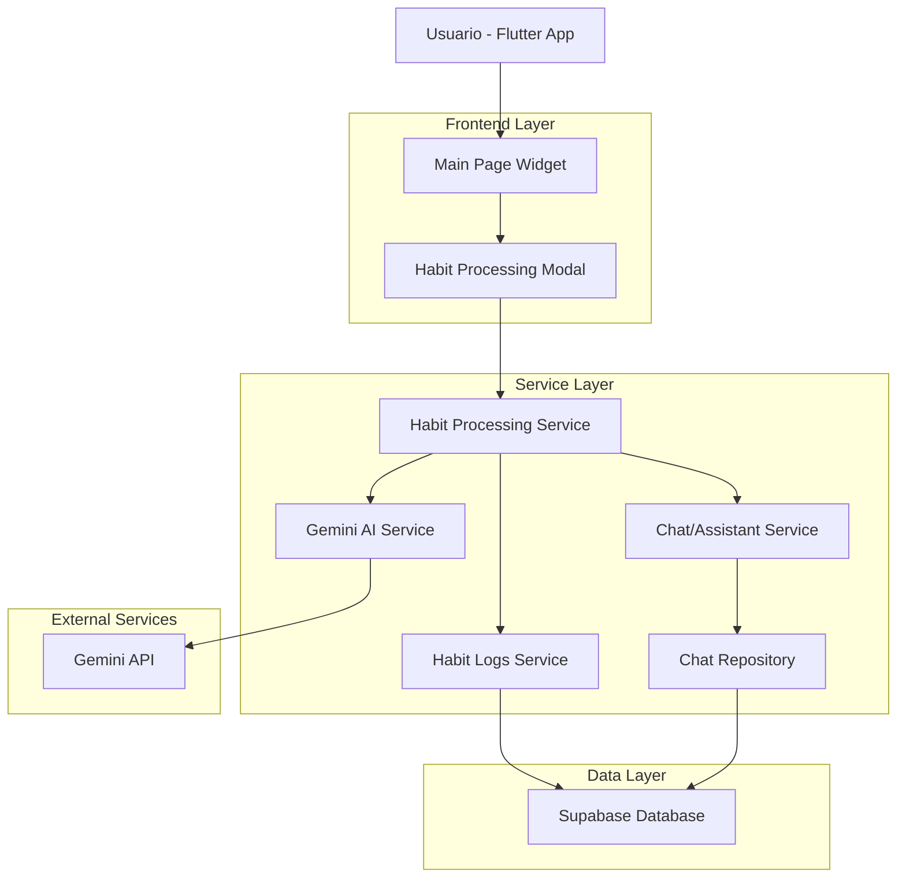
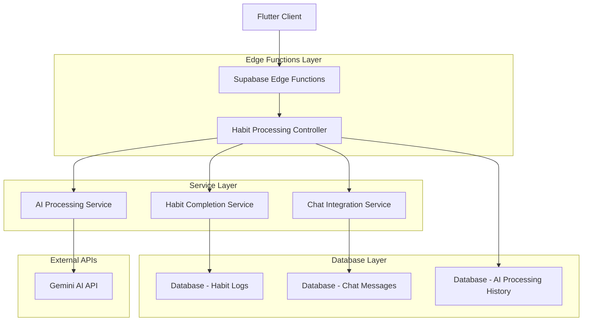
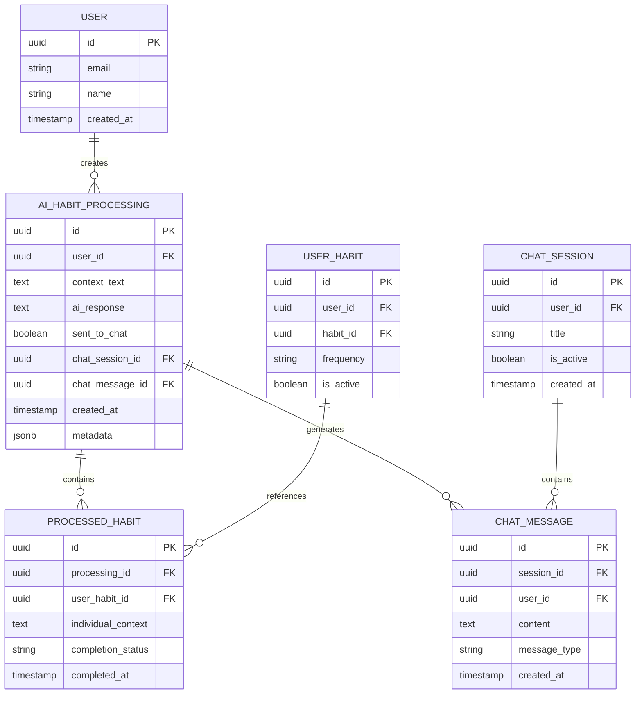

# Procesamiento Inteligente de Hábitos con IA - Documento de Arquitectura Técnica

## 1. Diseño de Arquitectura



## 2. Descripción de Tecnologías

- Frontend: Flutter 3.x + Dart + BLoC Pattern
- Backend: Supabase (PostgreSQL + Edge Functions)
- IA: Gemini AI API (Google)
- Estado: flutter_bloc para manejo de estado reactivo
- Base de datos: PostgreSQL (Supabase)

## 3. Definiciones de Rutas

| Ruta | Propósito |
|------|-----------|
| /main | Página principal con selección de hábitos y nueva opción de procesamiento IA |
| /chat | Página de chat donde se pueden recibir respuestas automáticas de IA |
| /assistant | Página de asistente donde se pueden recibir respuestas automáticas de IA |
| Modal: HabitProcessingModal | Modal para entrada de contexto y configuración de procesamiento IA |

## 4. Definiciones de API

### 4.1 API Principal

**Procesamiento de hábitos con IA**
```
POST /api/habits/process-with-ai
```

Request:
| Nombre del Parámetro | Tipo del Parámetro | Es Requerido | Descripción |
|---------------------|-------------------|--------------|-------------|
| user_id | string | true | ID del usuario autenticado |
| habit_ids | array<string> | true | Lista de IDs de hábitos a procesar |
| context_text | string | true | Contexto adicional proporcionado por el usuario |
| individual_contexts | object | false | Contexto específico por hábito {habit_id: context} |
| send_to_chat | boolean | false | Si enviar la respuesta al chat/asistente |
| session_id | string | false | ID de sesión de chat activa (si send_to_chat es true) |

Response:
| Nombre del Parámetro | Tipo del Parámetro | Descripción |
|---------------------|-------------------|-------------|
| success | boolean | Estado de la operación |
| ai_response | string | Respuesta generada por Gemini AI |
| processed_habits | array<object> | Lista de hábitos procesados con sus estados |
| processing_id | string | ID único del procesamiento para historial |
| chat_message_id | string | ID del mensaje creado en chat (si aplicable) |

Ejemplo Request:
```json
{
  "user_id": "user_123",
  "habit_ids": ["habit_1", "habit_2"],
  "context_text": "No pude hacer ejercicio completo, solo caminé 20 minutos. Para la meditación, solo logré 5 minutos porque tuve interrupciones.",
  "individual_contexts": {
    "habit_1": "Caminé en lugar de correr",
    "habit_2": "Solo 5 minutos de meditación"
  },
  "send_to_chat": true,
  "session_id": "session_456"
}
```

**Obtener historial de procesamiento IA**
```
GET /api/habits/ai-processing-history
```

Request:
| Nombre del Parámetro | Tipo del Parámetro | Es Requerido | Descripción |
|---------------------|-------------------|--------------|-------------|
| user_id | string | true | ID del usuario |
| limit | integer | false | Número máximo de registros (default: 20) |
| offset | integer | false | Offset para paginación (default: 0) |

Response:
| Nombre del Parámetro | Tipo del Parámetro | Descripción |
|---------------------|-------------------|-------------|
| processing_history | array<object> | Lista de procesamientos anteriores |
| total_count | integer | Total de registros disponibles |

## 5. Arquitectura del Servidor



## 6. Modelo de Datos

### 6.1 Definición del Modelo de Datos



### 6.2 Lenguaje de Definición de Datos (DDL)

**Tabla de Procesamiento IA de Hábitos (ai_habit_processing)**
```sql
-- Crear tabla principal de procesamiento IA
CREATE TABLE ai_habit_processing (
    id UUID PRIMARY KEY DEFAULT gen_random_uuid(),
    user_id UUID NOT NULL REFERENCES auth.users(id) ON DELETE CASCADE,
    context_text TEXT NOT NULL,
    ai_response TEXT,
    sent_to_chat BOOLEAN DEFAULT false,
    chat_session_id UUID REFERENCES chat_sessions(id),
    chat_message_id UUID REFERENCES chat_messages(id),
    created_at TIMESTAMP WITH TIME ZONE DEFAULT NOW(),
    updated_at TIMESTAMP WITH TIME ZONE DEFAULT NOW(),
    metadata JSONB DEFAULT '{}'::jsonb
);

-- Crear índices para optimización
CREATE INDEX idx_ai_habit_processing_user_id ON ai_habit_processing(user_id);
CREATE INDEX idx_ai_habit_processing_created_at ON ai_habit_processing(created_at DESC);
CREATE INDEX idx_ai_habit_processing_chat_session ON ai_habit_processing(chat_session_id);

-- Habilitar RLS (Row Level Security)
ALTER TABLE ai_habit_processing ENABLE ROW LEVEL SECURITY;

-- Política de seguridad: usuarios solo pueden ver sus propios procesamientos
CREATE POLICY "Users can view own AI processing" ON ai_habit_processing
    FOR SELECT USING (auth.uid() = user_id);

CREATE POLICY "Users can insert own AI processing" ON ai_habit_processing
    FOR INSERT WITH CHECK (auth.uid() = user_id);
```

**Tabla de Hábitos Procesados (processed_habits)**
```sql
-- Crear tabla de hábitos procesados individualmente
CREATE TABLE processed_habits (
    id UUID PRIMARY KEY DEFAULT gen_random_uuid(),
    processing_id UUID NOT NULL REFERENCES ai_habit_processing(id) ON DELETE CASCADE,
    user_habit_id UUID NOT NULL REFERENCES user_habits(id) ON DELETE CASCADE,
    individual_context TEXT,
    completion_status VARCHAR(20) DEFAULT 'completed' CHECK (completion_status IN ('completed', 'partial', 'modified')),
    completed_at TIMESTAMP WITH TIME ZONE DEFAULT NOW(),
    created_at TIMESTAMP WITH TIME ZONE DEFAULT NOW()
);

-- Crear índices
CREATE INDEX idx_processed_habits_processing_id ON processed_habits(processing_id);
CREATE INDEX idx_processed_habits_user_habit_id ON processed_habits(user_habit_id);
CREATE INDEX idx_processed_habits_completed_at ON processed_habits(completed_at DESC);

-- Habilitar RLS
ALTER TABLE processed_habits ENABLE ROW LEVEL SECURITY;

-- Política de seguridad
CREATE POLICY "Users can view own processed habits" ON processed_habits
    FOR SELECT USING (
        EXISTS (
            SELECT 1 FROM ai_habit_processing ahp 
            WHERE ahp.id = processing_id AND ahp.user_id = auth.uid()
        )
    );

CREATE POLICY "Users can insert own processed habits" ON processed_habits
    FOR INSERT WITH CHECK (
        EXISTS (
            SELECT 1 FROM ai_habit_processing ahp 
            WHERE ahp.id = processing_id AND ahp.user_id = auth.uid()
        )
    );
```

**Función almacenada para procesamiento completo**
```sql
-- Función para procesar hábitos con IA
CREATE OR REPLACE FUNCTION process_habits_with_ai(
    p_user_id UUID,
    p_habit_ids UUID[],
    p_context_text TEXT,
    p_individual_contexts JSONB DEFAULT '{}'::jsonb,
    p_ai_response TEXT DEFAULT NULL
) RETURNS UUID AS $$
DECLARE
    v_processing_id UUID;
    v_habit_id UUID;
BEGIN
    -- Crear registro de procesamiento principal
    INSERT INTO ai_habit_processing (user_id, context_text, ai_response)
    VALUES (p_user_id, p_context_text, p_ai_response)
    RETURNING id INTO v_processing_id;
    
    -- Procesar cada hábito individualmente
    FOREACH v_habit_id IN ARRAY p_habit_ids
    LOOP
        -- Insertar en processed_habits
        INSERT INTO processed_habits (
            processing_id, 
            user_habit_id, 
            individual_context,
            completion_status
        ) VALUES (
            v_processing_id,
            v_habit_id,
            COALESCE((p_individual_contexts->v_habit_id::text)::text, ''),
            'completed'
        );
        
        -- Crear log de hábito completado
        INSERT INTO user_habit_logs (
            user_id,
            user_habit_id,
            status,
            completed_at,
            notes
        ) VALUES (
            p_user_id,
            v_habit_id,
            'completed',
            NOW(),
            CONCAT('Procesado con IA: ', p_context_text)
        );
    END LOOP;
    
    RETURN v_processing_id;
END;
$$ LANGUAGE plpgsql SECURITY DEFINER;
```

**Datos iniciales**
```sql
-- No se requieren datos iniciales específicos para esta funcionalidad
-- Los datos se generarán dinámicamente basados en el uso del usuario
```