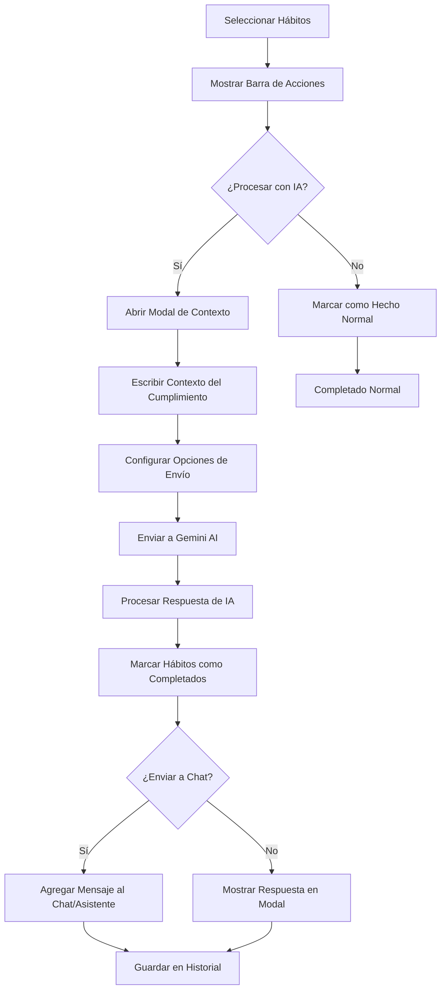

# Procesamiento Inteligente de Hábitos con IA - Documento de Requerimientos del Producto

## 1. Descripción General del Producto

Sistema de procesamiento inteligente que permite a los usuarios enviar contexto adicional sobre el cumplimiento de sus hábitos a la IA de Gemini para obtener feedback personalizado y mejorar el seguimiento de hábitos.

- **Problema a resolver**: Los usuarios a menudo no cumplen los hábitos exactamente como están definidos, pero sí realizan actividades relacionadas que deberían ser reconocidas y procesadas inteligentemente.
- **Usuarios objetivo**: Usuarios activos de ViveGood que buscan un seguimiento más flexible y personalizado de sus hábitos.
- **Valor del producto**: Transformar el seguimiento rígido de hábitos en un sistema adaptativo e inteligente que reconoce el esfuerzo parcial y proporciona orientación personalizada.

## 2. Características Principales

### 2.1 Roles de Usuario
No se requieren roles adicionales. La funcionalidad está disponible para todos los usuarios autenticados de ViveGood.

### 2.2 Módulo de Características

Nuestro sistema de procesamiento inteligente de hábitos consiste en las siguientes funcionalidades principales:

1. **Interfaz de Procesamiento IA**: Modal de entrada de contexto adicional sobre el cumplimiento del hábito.
2. **Sistema de Análisis Inteligente**: Procesamiento del contexto del usuario mediante Gemini AI.
3. **Integración con Chat/Asistente**: Envío automático de la respuesta de IA a la conversación existente.
4. **Historial de Procesamiento**: Registro y seguimiento de todas las interacciones de procesamiento IA.

### 2.3 Detalles de Páginas

| Nombre de Página | Nombre del Módulo | Descripción de Características |
|------------------|-------------------|--------------------------------|
| Página Principal (Main Page) | Botón de Procesamiento IA | Agregar botón "Procesar con IA" junto al botón "Marcar como hecho" en la barra de selección inferior |
| Modal de Contexto IA | Entrada de Texto Contextual | Campo de texto multilínea para que el usuario describa cómo cumplió el hábito, limitaciones o variaciones |
| Modal de Contexto IA | Selección de Hábitos | Lista de hábitos seleccionados con opción de personalizar el contexto por hábito individual |
| Modal de Contexto IA | Botones de Acción | Botón "Procesar con IA", "Cancelar" y toggle para "Enviar a Chat/Asistente" |
| Chat/Asistente | Mensaje Automático IA | Mostrar la respuesta de Gemini como un mensaje del asistente en la conversación activa |
| Historial de Procesamiento | Lista de Interacciones | Mostrar historial de procesamientos IA con fecha, hábitos procesados y respuesta de IA |

## 3. Proceso Principal

### Flujo de Usuario Principal:

1. **Selección de Hábitos**: El usuario selecciona uno o múltiples hábitos en la página principal
2. **Acceso a Opciones**: Aparece la barra inferior con "Marcar como hecho" y el nuevo botón "Procesar con IA"
3. **Entrada de Contexto**: Al presionar "Procesar con IA", se abre un modal donde el usuario puede:
   - Ver los hábitos seleccionados
   - Escribir contexto adicional sobre cómo cumplió cada hábito
   - Activar/desactivar el envío automático al chat/asistente
4. **Procesamiento IA**: El sistema envía la información a Gemini AI para análisis
5. **Respuesta y Registro**: La IA procesa la información y:
   - Marca los hábitos como completados (con contexto)
   - Genera feedback personalizado
   - Opcionalmente envía la respuesta al chat/asistente
   - Guarda el registro en el historial

## 4. Diseño de Interfaz de Usuario

### 4.1 Estilo de Diseño

- **Colores primarios**: Verde #4CAF50 (principal), Azul #6366F1 (IA), Gris #6B7280 (secundario)
- **Estilo de botones**: Redondeados con elevación sutil, iconos descriptivos
- **Fuente**: Poppins, tamaños 14px (cuerpo), 16px (botones), 18px (títulos)
- **Estilo de layout**: Cards con sombras suaves, espaciado consistente de 16px
- **Iconos**: Material Icons con estilo filled, colores coherentes con la acción

### 4.2 Descripción General del Diseño de Páginas

| Nombre de Página | Nombre del Módulo | Elementos de UI |
|------------------|-------------------|-----------------|
| Página Principal | Barra de Acciones Inferior | Botón "Procesar con IA" con icono de cerebro/estrella, color azul #6366F1, posicionado junto al botón verde de completar |
| Modal de Contexto IA | Encabezado del Modal | Título "Procesar Hábitos con IA", icono de Gemini, botón de cerrar |
| Modal de Contexto IA | Lista de Hábitos | Cards compactos mostrando nombre del hábito, icono y campo de texto para contexto individual |
| Modal de Contexto IA | Área de Texto Principal | Campo de texto multilínea con placeholder "Describe cómo cumpliste estos hábitos...", contador de caracteres |
| Modal de Contexto IA | Opciones de Configuración | Switch para "Enviar respuesta al chat/asistente", texto explicativo |
| Modal de Contexto IA | Botones de Acción | "Cancelar" (gris), "Procesar con IA" (azul con icono de envío) |
| Respuesta IA | Card de Resultado | Fondo azul claro, icono de IA, texto de respuesta formateado, botones para "Ver en Chat" y "Cerrar" |

### 4.3 Responsividad

El diseño es mobile-first con adaptación para tablets. Los modales se ajustan al tamaño de pantalla manteniendo márgenes apropiados. En dispositivos pequeños, el modal ocupa el 90% de la pantalla con scroll interno si es necesario.

## 5. Consideraciones Técnicas

### 5.1 Integración con Sistemas Existentes

- **Sistema de Hábitos**: Extensión del flujo actual de marcado de hábitos completados
- **Gemini AI**: Utilización de la integración existente con contexto específico para procesamiento de hábitos
- **Chat/Asistente**: Inyección automática de mensajes en conversaciones activas
- **Base de Datos**: Nueva tabla para almacenar interacciones de procesamiento IA

### 5.2 Casos de Uso Específicos

1. **Cumplimiento Parcial**: "No pude correr 30 minutos, pero caminé 45 minutos"
2. **Variación de Actividad**: "En lugar de ir al gimnasio, hice ejercicios en casa"
3. **Limitaciones Temporales**: "Solo pude meditar 5 minutos en lugar de 20"
4. **Contexto Emocional**: "Me costó mucho motivarme hoy, pero lo logré"
5. **Múltiples Hábitos**: Procesamiento conjunto de varios hábitos con contexto global

### 5.3 Métricas de Éxito

- **Adopción**: % de usuarios que utilizan el procesamiento IA vs marcado normal
- **Engagement**: Frecuencia de uso de la funcionalidad por usuario activo
- **Satisfacción**: Calificación de utilidad de las respuestas de IA
- **Retención**: Impacto en la continuidad del seguimiento de hábitos
- **Conversión**: Usuarios que migran de marcado simple a procesamiento IA