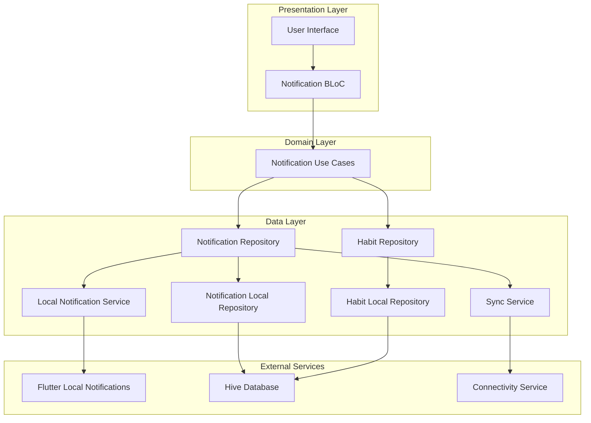
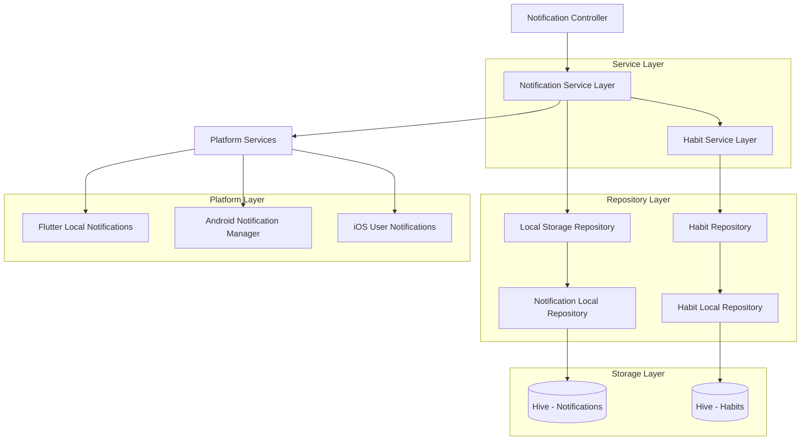
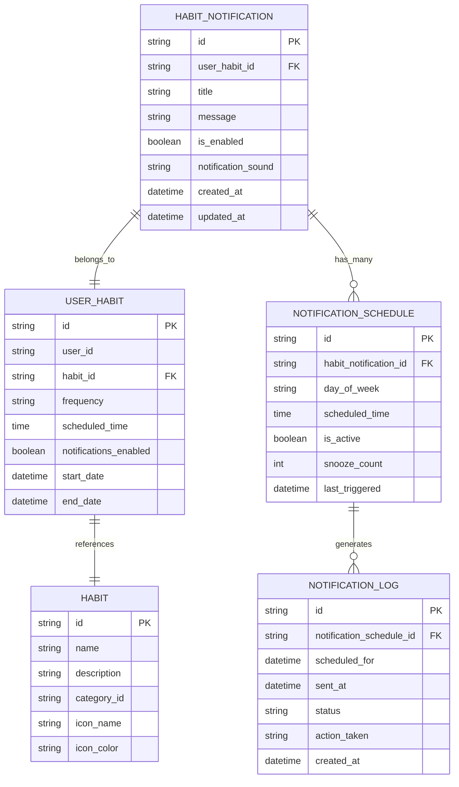

# Sistema de Notificaciones de Hábitos Diarios - Arquitectura Técnica

## 1. Architecture design



## 2. Technology Description

- Frontend: Flutter con arquitectura BLoC para gestión de estado
- Notificaciones Locales: flutter_local_notifications@17.0.0
- Base de Datos Local: Hive (ya implementado)
- Programación de Tareas: timezone@0.9.0 para manejo de zonas horarias
- Arquitectura: Clean Architecture con patrón Repository

## 3. Route definitions

| Route | Purpose |
|-------|---------|
| /notifications/settings | Configuración general de notificaciones y permisos |
| /habits/:id/notifications | Configuración específica de notificaciones para un hábito |
| /notifications/schedule | Vista de horarios programados y gestión de recordatorios |
| /notifications/history | Historial de notificaciones enviadas y estadísticas |

## 4. API definitions

### 4.1 Core API

**Casos de Uso de Notificaciones**

```typescript
// Programar notificación de hábito
ScheduleHabitNotificationUseCase
```

Request:
| Param Name | Param Type | isRequired | Description |
|------------|------------|------------|-------------|
| userHabitId | String | true | ID del hábito del usuario |
| scheduledTime | DateTime | true | Hora programada para la notificación |
| message | String | false | Mensaje personalizado (opcional) |

Response:
| Param Name | Param Type | Description |
|------------|------------|-------------|
| notificationId | String | ID único de la notificación programada |
| success | boolean | Estado de la operación |

```typescript
// Cancelar notificación de hábito
CancelHabitNotificationUseCase
```

Request:
| Param Name | Param Type | isRequired | Description |
|------------|------------|------------|-------------|
| notificationId | String | true | ID de la notificación a cancelar |

Response:
| Param Name | Param Type | Description |
|------------|------------|-------------|
| success | boolean | Estado de la operación |

```typescript
// Obtener notificaciones pendientes
GetPendingNotificationsUseCase
```

Response:
| Param Name | Param Type | Description |
|------------|------------|-------------|
| notifications | List<HabitNotification> | Lista de notificaciones programadas |

```typescript
// Configurar recordatorio con snooze
SnoozeNotificationUseCase
```

Request:
| Param Name | Param Type | isRequired | Description |
|------------|------------|------------|-------------|
| notificationId | String | true | ID de la notificación |
| snoozeMinutes | int | true | Minutos para posponer (5, 15, 30, 60) |

## 5. Server architecture diagram



## 6. Data model

### 6.1 Data model definition



### 6.2 Data Definition Language

**Tabla de Notificaciones de Hábitos (habit_notifications)**
```dart
// Hive TypeAdapter para HabitNotification
@HiveType(typeId: 10)
class HabitNotificationLocalModel extends HiveObject {
  @HiveField(0)
  String id;
  
  @HiveField(1)
  String userHabitId;
  
  @HiveField(2)
  String title;
  
  @HiveField(3)
  String? message;
  
  @HiveField(4)
  bool isEnabled;
  
  @HiveField(5)
  String? notificationSound;
  
  @HiveField(6)
  List<NotificationScheduleLocalModel> schedules;
  
  @HiveField(7)
  DateTime createdAt;
  
  @HiveField(8)
  DateTime updatedAt;
  
  @HiveField(9)
  bool isSynced;
}
```

**Tabla de Horarios de Notificación (notification_schedules)**
```dart
// Hive TypeAdapter para NotificationSchedule
@HiveType(typeId: 11)
class NotificationScheduleLocalModel extends HiveObject {
  @HiveField(0)
  String id;
  
  @HiveField(1)
  String habitNotificationId;
  
  @HiveField(2)
  String dayOfWeek; // 'monday', 'tuesday', etc. o 'daily'
  
  @HiveField(3)
  String scheduledTime; // HH:mm format
  
  @HiveField(4)
  bool isActive;
  
  @HiveField(5)
  int snoozeCount;
  
  @HiveField(6)
  DateTime? lastTriggered;
  
  @HiveField(7)
  int platformNotificationId; // ID usado por flutter_local_notifications
}
```

**Tabla de Log de Notificaciones (notification_logs)**
```dart
// Hive TypeAdapter para NotificationLog
@HiveType(typeId: 12)
class NotificationLogLocalModel extends HiveObject {
  @HiveField(0)
  String id;
  
  @HiveField(1)
  String notificationScheduleId;
  
  @HiveField(2)
  DateTime scheduledFor;
  
  @HiveField(3)
  DateTime? sentAt;
  
  @HiveField(4)
  String status; // 'scheduled', 'sent', 'failed', 'cancelled'
  
  @HiveField(5)
  String? actionTaken; // 'completed', 'snoozed', 'dismissed', 'ignored'
  
  @HiveField(6)
  DateTime createdAt;
}
```

**Configuración de Permisos y Preferencias**
```dart
// Configuración global de notificaciones
@HiveType(typeId: 13)
class NotificationSettingsLocalModel extends HiveObject {
  @HiveField(0)
  String userId;
  
  @HiveField(1)
  bool globalNotificationsEnabled;
  
  @HiveField(2)
  bool permissionsGranted;
  
  @HiveField(3)
  String? quietHoursStart; // HH:mm
  
  @HiveField(4)
  String? quietHoursEnd; // HH:mm
  
  @HiveField(5)
  int defaultSnoozeMinutes;
  
  @HiveField(6)
  int maxSnoozeCount;
  
  @HiveField(7)
  String defaultNotificationSound;
  
  @HiveField(8)
  DateTime updatedAt;
}
```

**Inicialización de Datos**
```dart
// Configuración por defecto para nuevos usuarios
final defaultSettings = NotificationSettingsLocalModel(
  userId: currentUserId,
  globalNotificationsEnabled: true,
  permissionsGranted: false,
  quietHoursStart: '22:00',
  quietHoursEnd: '07:00',
  defaultSnoozeMinutes: 15,
  maxSnoozeCount: 3,
  defaultNotificationSound: 'default',
  updatedAt: DateTime.now(),
);

// Programación automática para hábitos existentes
for (final userHabit in existingHabits) {
  if (userHabit.notificationsEnabled && userHabit.scheduledTime != null) {
    await createDefaultNotificationSchedule(userHabit);
  }
}
```