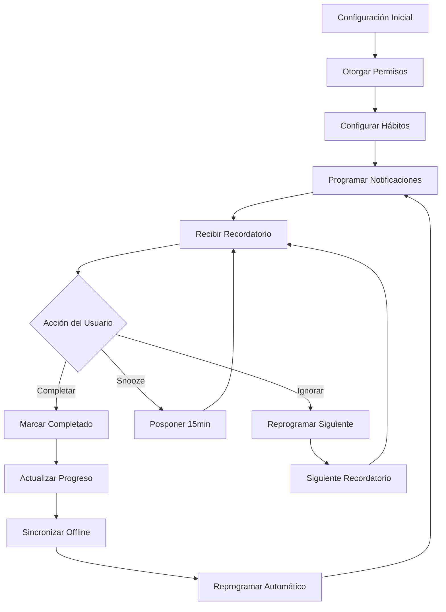

# Sistema de Notificaciones de Hábitos Diarios - PRD

## 1. Product Overview

Sistema de notificaciones push locales que recuerda a los usuarios completar sus hábitos diarios en los horarios programados, integrado con la arquitectura offline-first existente de ViveGood App.

- Permite a los usuarios recibir recordatorios automáticos para mantener la consistencia en sus hábitos diarios, mejorando la adherencia y formación de rutinas saludables.
- Dirigido a usuarios que buscan mantener disciplina y constancia en sus objetivos de bienestar personal a través de recordatorios inteligentes y personalizables.

## 2. Core Features

### 2.1 User Roles
No se requieren roles adicionales. Todos los usuarios registrados tendrán acceso completo a las funcionalidades de notificaciones.

### 2.2 Feature Module

Nuestro sistema de notificaciones de hábitos consiste en las siguientes funcionalidades principales:

1. **Configuración de Notificaciones**: gestión de horarios, activación/desactivación, personalización de mensajes.
2. **Programación Automática**: creación automática de recordatorios basados en la frecuencia de hábitos.
3. **Gestión de Permisos**: solicitud y verificación de permisos del sistema operativo.
4. **Recordatorios Inteligentes**: snooze, repetición y escalamiento de notificaciones.
5. **Sincronización Offline**: manejo de notificaciones sin conexión a internet.

### 2.3 Page Details

| Page Name | Module Name | Feature description |
|-----------|-------------|---------------------|
| Configuración de Hábitos | Horarios de Notificación | Configurar horarios específicos para cada hábito, activar/desactivar notificaciones por hábito, personalizar mensajes de recordatorio |
| Configuración General | Permisos de Notificaciones | Solicitar permisos del sistema, verificar estado de permisos, configuración global de notificaciones |
| Dashboard Principal | Indicadores de Notificaciones | Mostrar próximas notificaciones programadas, estado de recordatorios pendientes, acceso rápido a configuración |
| Pantalla de Notificación | Acciones de Recordatorio | Marcar hábito como completado, posponer recordatorio (snooze), acceder directamente al hábito |
| Configuración Avanzada | Gestión de Recordatorios | Configurar intervalos de snooze, límites de repetición, horarios de silencio (no molestar) |

## 3. Core Process

### Flujo Principal del Usuario:

1. **Configuración Inicial**: El usuario activa las notificaciones en la configuración de la app y otorga permisos del sistema
2. **Configuración de Hábitos**: Para cada hábito, el usuario configura horarios específicos de recordatorio y personaliza mensajes
3. **Programación Automática**: El sistema programa automáticamente las notificaciones basándose en la frecuencia del hábito (diario, semanal, etc.)
4. **Recepción de Notificaciones**: El usuario recibe recordatorios en los horarios programados
5. **Interacción con Recordatorios**: El usuario puede marcar como completado, posponer (snooze) o acceder al hábito directamente
6. **Gestión Continua**: El sistema reprograma automáticamente las siguientes notificaciones y maneja la sincronización offline

### Flujo de Sincronización Offline:
1. **Sin Conexión**: Las notificaciones se programan localmente y funcionan independientemente de la conectividad
2. **Reconexión**: Al recuperar conexión, se sincronizan los estados de completado y configuraciones con el servidor
3. **Conflictos**: Se resuelven priorizando las acciones más recientes del usuario

## 4. User Interface Design

### 4.1 Design Style

- **Colores Primarios**: Verde principal (#4CAF50) para acciones positivas, naranja (#FF9800) para recordatorios
- **Colores Secundarios**: Gris suave (#F5F5F5) para fondos, azul (#2196F3) para configuraciones
- **Estilo de Botones**: Redondeados con elevación sutil, iconos Material Design
- **Tipografía**: Roboto 16px para texto principal, 14px para secundario, 18px para títulos
- **Layout**: Cards con bordes redondeados, espaciado consistente de 16px, navegación por pestañas
- **Iconos**: Material Icons para notificaciones (notifications), horarios (schedule), configuración (settings)

### 4.2 Page Design Overview

| Page Name | Module Name | UI Elements |
|-----------|-------------|-------------|
| Configuración de Hábitos | Horarios de Notificación | Lista de hábitos con switches de activación, time pickers para horarios, campos de texto para mensajes personalizados, botones de prueba de notificación |
| Configuración General | Permisos de Notificaciones | Card de estado de permisos con indicador visual, botón prominente para solicitar permisos, toggle global de notificaciones, configuración de horarios de silencio |
| Dashboard Principal | Indicadores de Notificaciones | Badge con contador de notificaciones pendientes, lista compacta de próximos recordatorios, acceso rápido a configuración mediante FAB |
| Pantalla de Notificación | Acciones de Recordatorio | Diseño full-screen con imagen del hábito, botones grandes para acciones principales, opciones de snooze en bottom sheet |
| Configuración Avanzada | Gestión de Recordatorios | Sliders para intervalos de tiempo, switches para opciones avanzadas, time range picker para horarios de silencio |

### 4.3 Responsiveness

Diseño mobile-first optimizado para pantallas de 5-7 pulgadas, con soporte para tablets mediante layout adaptativo. Incluye optimización para interacciones táctiles con áreas de toque mínimas de 44px y gestos de swipe para acciones rápidas en notificaciones.