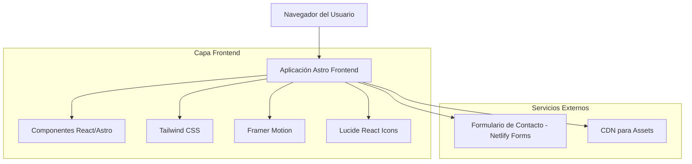

# Documento de Arquitectura Técnica - Sitio Web Promocional Vive Good App

## 1. Diseño de Arquitectura



## 2. Descripción de Tecnologías

- **Frontend**: Astro@4 + React@18 + TypeScript + Tailwind CSS@3 + Framer Motion + Lucide React
- **Backend**: Ninguno (sitio estático)
- **Servicios**: Netlify Forms para formulario de contacto

## 3. Definiciones de Rutas

| Ruta | Propósito |
|------|-----------|
| / | Página de inicio con hero section, características destacadas y call-to-action |
| /about | Página acerca del proyecto, equipo de desarrollo y tecnologías utilizadas |
| /features | Página detallada de características y funcionalidades de la app |
| /download | Página de descarga del APK con instrucciones de instalación |
| /contact | Página de contacto con formulario y información del desarrollador |

## 4. Definiciones de API (No aplicable)

Este proyecto es un sitio web estático sin backend, por lo que no requiere definiciones de API. El formulario de contacto utiliza Netlify Forms para el procesamiento.

## 5. Arquitectura del Servidor (No aplicable)

Al ser un sitio estático generado con Astro, no requiere arquitectura de servidor backend.

## 6. Modelo de Datos (No aplicable)

### 6.1 Definición del Modelo de Datos

No se requiere base de datos para este proyecto, ya que es un sitio web informativo estático.

### 6.2 Lenguaje de Definición de Datos

No aplicable - el sitio web no utiliza base de datos.

## 7. Estructura de Componentes

### 7.1 Componentes Principales

```
src/
├── components/
│   ├── layout/
│   │   ├── Header.astro
│   │   ├── Footer.astro
│   │   └── Navigation.astro
│   ├── ui/
│   │   ├── Button.astro
│   │   ├── Card.astro
│   │   ├── Modal.astro
│   │   └── AnimatedIcon.tsx
│   ├── sections/
│   │   ├── HeroSection.astro
│   │   ├── FeaturesGrid.astro
│   │   ├── TestimonialsCarousel.tsx
│   │   ├── DownloadSection.astro
│   │   └── ContactForm.tsx
│   └── animations/
│       ├── FadeIn.tsx
│       ├── SlideUp.tsx
│       └── ParallaxEffect.tsx
├── layouts/
│   └── Layout.astro
├── pages/
│   ├── index.astro
│   ├── about.astro
│   ├── features.astro
│   ├── download.astro
│   └── contact.astro
├── styles/
│   └── global.css
└── assets/
    ├── images/
    ├── icons/
    └── videos/
```

### 7.2 Configuración de Animaciones

- **Framer Motion**: Para animaciones complejas de componentes React
- **CSS Animations**: Para transiciones simples y efectos hover
- **Intersection Observer**: Para animaciones activadas por scroll
- **Lottie**: Para animaciones vectoriales complejas (opcional)

### 7.3 Optimizaciones de Performance

- **Astro Islands**: Hidratación selectiva de componentes interactivos
- **Image Optimization**: Compresión automática y formatos modernos (WebP, AVIF)
- **Code Splitting**: Carga lazy de componentes pesados
- **Critical CSS**: Inlining de estilos críticos above-the-fold
- **Preloading**: Precarga de recursos importantes