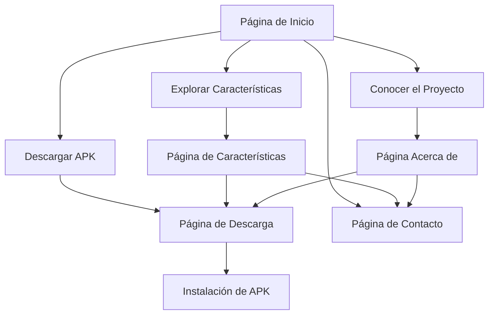

# Documento de Requisitos del Producto - Sitio Web Promocional Vive Good App

## 1. Descripción General del Producto

Sitio web promocional moderno y atractivo para la aplicación móvil "Vive Good App", diseñado para presentar las características principales de la aplicación de gestión de hábitos a estudiantes y usuarios potenciales. El sitio incluirá información detallada del proyecto, funcionalidades clave, y facilitará la descarga directa del APK de la aplicación.

- **Propósito**: Promocionar y distribuir la aplicación Vive Good App, aumentando la adopción entre estudiantes y usuarios interesados en mejorar sus hábitos.
- **Audiencia objetivo**: Estudiantes universitarios, profesionales jóvenes y personas interesadas en desarrollo personal y gestión de hábitos.
- **Valor del mercado**: Posicionamiento como una solución integral de gestión de hábitos con tecnología AI avanzada y diseño intuitivo.

## 2. Características Principales

### 2.1 Roles de Usuario (no aplicable)
Este sitio web es informativo y no requiere registro de usuarios ni distinción de roles.

### 2.2 Módulo de Características

Nuestro sitio web promocional consta de las siguientes páginas principales:

1. **Página de Inicio**: hero section con animaciones, navegación principal, características destacadas de la app, testimonios y call-to-action para descarga.
2. **Página Acerca de**: información detallada del proyecto, misión, visión, equipo de desarrollo y tecnologías utilizadas.
3. **Página de Características**: descripción completa de todas las funcionalidades de la app con capturas de pantalla y demostraciones interactivas.
4. **Página de Descarga**: información de descarga del APK, requisitos del sistema, instrucciones de instalación y enlaces directos.
5. **Página de Contacto**: formulario de contacto, información del desarrollador, redes sociales y soporte técnico.

### 2.3 Detalles de Páginas

| Nombre de Página | Nombre del Módulo | Descripción de Características |
|------------------|-------------------|--------------------------------|
| Página de Inicio | Hero Section | Animación de bienvenida con logo, título impactante y descripción breve de la app |
| Página de Inicio | Características Destacadas | Grid de características principales con iconos animados y descripciones concisas |
| Página de Inicio | Testimonios | Carrusel de testimonios de usuarios con animaciones de transición |
| Página de Inicio | Call-to-Action | Botón prominente de descarga con animaciones hover y efectos visuales |
| Página Acerca de | Información del Proyecto | Historia del proyecto, objetivos y beneficios para los usuarios |
| Página Acerca de | Equipo de Desarrollo | Información del desarrollador con foto, habilidades y experiencia |
| Página Acerca de | Tecnologías | Stack tecnológico utilizado con logos y descripciones |
| Página de Características | Gestión de Hábitos | Descripción detallada del sistema de hábitos con categorías y frecuencias |
| Página de Características | Asistente AI | Explicación de las capacidades de inteligencia artificial y sugerencias automáticas |
| Página de Características | Dashboard y Estadísticas | Visualización de gráficos y métricas de progreso del usuario |
| Página de Características | Calendario Dinámico | Integración de calendario con sincronización automática de eventos |
| Página de Características | Notificaciones | Sistema de recordatorios personalizables y notificaciones inteligentes |
| Página de Descarga | Información del APK | Detalles de la versión, tamaño del archivo y fecha de actualización |
| Página de Descarga | Requisitos del Sistema | Versiones de Android compatibles y especificaciones mínimas |
| Página de Descarga | Instrucciones de Instalación | Guía paso a paso para instalar APK con capturas de pantalla |
| Página de Descarga | Enlaces de Descarga | Botones de descarga directa con verificación de integridad |
| Página de Contacto | Formulario de Contacto | Campos para nombre, email, asunto y mensaje con validación |
| Página de Contacto | Información del Desarrollador | Datos de contacto, ubicación y horarios de atención |
| Página de Contacto | Redes Sociales | Enlaces a perfiles sociales con iconos animados |

## 3. Proceso Principal

**Flujo Principal del Usuario:**
El usuario llega al sitio web, explora la información de la aplicación a través de las diferentes secciones, se informa sobre las características y beneficios, y finalmente procede a descargar el APK para instalar la aplicación en su dispositivo móvil.

## 4. Diseño de Interfaz de Usuario

### 4.1 Estilo de Diseño

- **Colores primarios**: Gradiente verde (#4CAF50) a azul (#2196F3) para transmitir crecimiento y confianza
- **Colores secundarios**: Blanco (#FFFFFF), gris claro (#F5F5F5) y gris oscuro (#333333)
- **Estilo de botones**: Botones redondeados con efectos de gradiente y animaciones hover suaves
- **Tipografía**: Inter como fuente principal (16px para cuerpo, 24px para subtítulos, 48px para títulos)
- **Estilo de layout**: Diseño moderno con cards flotantes, espaciado generoso y navegación sticky
- **Iconos y emojis**: Iconos de Lucide React con animaciones micro-interactivas y emojis para elementos amigables

### 4.2 Resumen de Diseño de Páginas

| Nombre de Página | Nombre del Módulo | Elementos de UI |
|------------------|-------------------|-----------------|
| Página de Inicio | Hero Section | Fondo con gradiente animado, logo con efecto parallax, título con animación de escritura, botón CTA con glow effect |
| Página de Inicio | Características Destacadas | Grid responsivo 3x2, cards con hover effects, iconos con animaciones de entrada, colores de acento por categoría |
| Página de Inicio | Testimonios | Carrusel horizontal con auto-play, avatares circulares, ratings con estrellas animadas, transiciones suaves |
| Página Acerca de | Información del Proyecto | Layout de dos columnas, imágenes con lazy loading, texto con fade-in animations, timeline interactiva |
| Página de Características | Gestión de Hábitos | Tabs interactivos, mockups de la app con efectos 3D, animaciones de scroll reveal, colores temáticos |
| Página de Descarga | Enlaces de Descarga | Botones prominentes con iconos de Android, progress bars animados, badges de versión, efectos de click |
| Página de Contacto | Formulario de Contacto | Campos con floating labels, validación en tiempo real, botón de envío con loading state, colores de estado |

### 4.3 Responsividad

El sitio web está diseñado con enfoque mobile-first, adaptándose perfectamente a dispositivos móviles, tablets y desktop. Incluye optimizaciones táctiles para navegación móvil, menú hamburguesa animado y ajustes de tipografía responsiva. Las animaciones se adaptan según el dispositivo para mantener performance óptima.